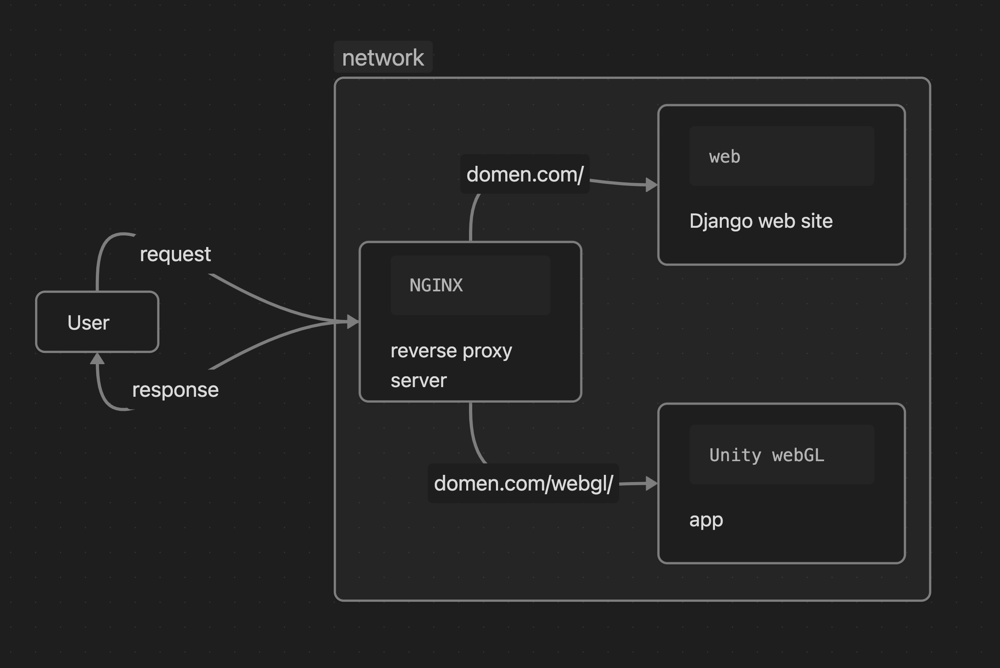

# GES2

## Описание проекта

Проект "Исследование цифровой смертности в виртуальных мирах" является частью грантовой программы, посвященной теме digital mortality. Эта тема затрагивает вопросы умирания и оставляемого виртуального следа, а также исследует память и медиаархеологию в контексте цифровой среды. Цель проекта - не только сохранение и архивирование цифровых останков, но и разработка новых методов взаимодействия с ними.

Идея исследования цифровой смертности возникла в результате изучения виртуальных миров, включая AlphaWorlds, одно из самых крупных и старейших пространств в ActiveWorlds. В ходе этого изучения было замечено множество способов, с помощью которых пользователи отмечают виртуальное пространство или его создателя как умершего. Это включает в себя простые надгробия с указанием имен пользователей, а также масштабные организованные похороны, сохраняющие стили и авторские подходы. Проект стремится понять, как эти проявления влияют на цифровые сообщества со временем, и предложить новые методы исследования и сохранения виртуальной памяти.

## Цели проекта

- Изучение механизмов и проявлений цифровой смертности в виртуальных мирах.
- Разработка новых подходов к сохранению и взаимодействию с цифровыми останками.
- Исследование локальных российских онлайн-платформ, таких как LoveCity3D, в контексте цифровой смертности.

## Методы

- Анализ исследований по теме цифровой смертности и медиаархеологии.
- Изучение виртуальных сообществ и их реакций на уход из жизни пользователей.
- Эксперименты с различными формами сохранения и взаимодействия с цифровыми останками.

## Ожидаемые результаты

- Новые методы исследования и сохранения цифровой памяти в виртуальных мирах.
- Разработка платформы или инструментов для взаимодействия с цифровыми останками.
- Углубленное понимание влияния цифровой смертности на интернет-коммьюнити.


# Техническая часть проекта
## Структура проекта

GES2/
├── GES/                            *Директория Django*
|   ├── GAS/
|   |   └── GAS/
|   |       └── apps/
|   |           ├── comments        *Обработка комментариев на сайте*
|   |           ├── map             *Перемещение по категориям (Карте)*
|   |           ├── PAGE            *Контент на страницах*
|   |           ├── service         *Сервисы (feedback)*
|   ├── media/
|   ├── static/
|   ├── db.sqlite3
|   └── manage.py  
|
├── webgl/                          *Директория приложения Unity(webGL)*
|   ├── Build
|   └── index.html
|
├── default.conf                    *Файл конфигурации nginx, который определяет его как обратный прокси сервер*
├── docker-compose.yml              *Докеркомпос файл с определением двух сервисов -> nginx и web(python Django)*
├── Dockerfile.nginx                *Докер файл для сервиса nginx*
├── Dockerfile.web                  *Докер файл для сервиса web(python Django)*
└── requirements.txt                *Зависомости для сервиса web(python Django)*

### Технологии

- Python 3.9 + Django
- Docker
- nginx

Проект представляет собой веб-приложение, разработанное с использованием фреймворка Django на языке Python. В ходе разработки возникла необходимость интеграции с веб-приложением Unity WebGL, что привело к решению упаковать весь проект в контейнер Docker для запуска нескольких сервисов: Django и Unity WebGL. Для обеспечения коммуникации между этими сервисами был создан обратный прокси-сервер Nginx, который также стал базой для работы с Unity. 

### Проксирование сервера
Проксирование сервера в нашем проекте обеспечивает связь между разными сервисами. Nginx слушает входящие запросы на порту 80 и направляет их: все запросы корневого URL отправляются к веб-серверу Django, а запросы к /webgl/ обрабатываются как статические файлы веб-приложения Unity WebGL. 




## Установка

### Требования

- Docker


### Запуск проекта

1. Соберите и запустите контейнер Docker:

```bash
docker-compose up --build
```

2. Перейдите на сайт, открыв браузер и вводя адрес:

```
http://localhost:8080
```

## Связь

Если у вас есть вопросы, предложения или баги, пожалуйста, свяжитесь с нами:

- https://t.me/fcg000
- https://github.com/fcg-coder